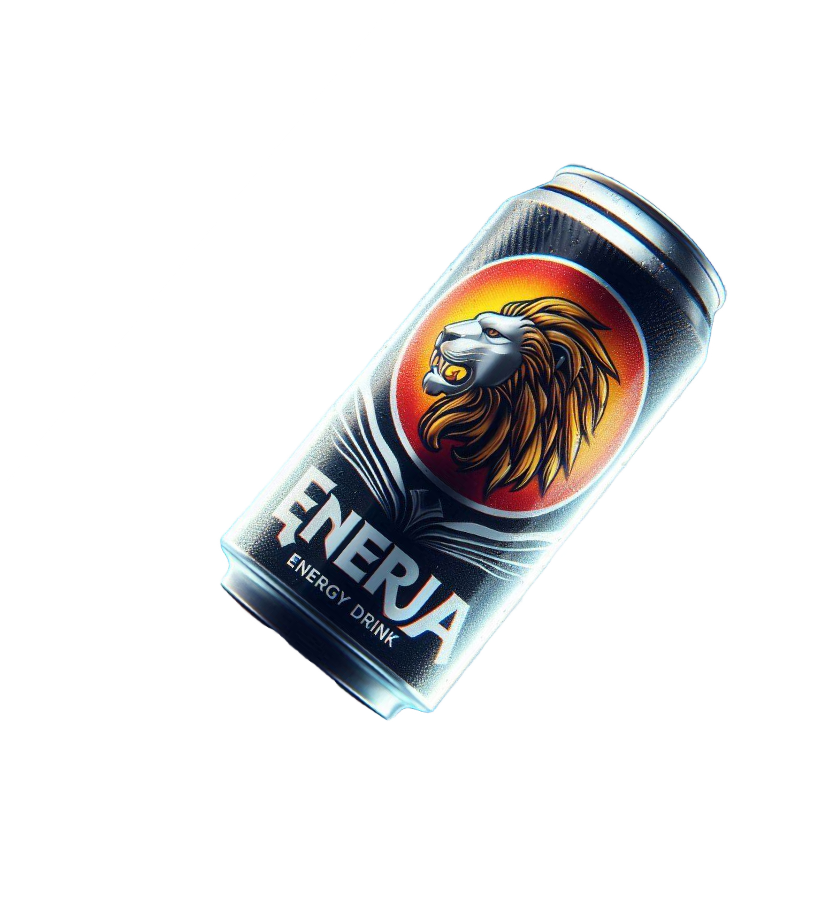

# Enerja ⚡

Category : UI/UX & Front End Web Development

Fully Responsive Website design and development featuring a concept Sri Lankan Energy Drink- Enerja.   
Built as a practice project to learn TailwindCSS with practice. There are different designs based on the device viewport to ensure that website looks good on all devices.

Known problems: Images need to be further compressed to improve performance.

Tech Stack: 

 

 </img>
> Live deployment at : https://subhanu-dev.github.io/Enerja/

> Dribbble Design: https://dribbble.com/shots/24476929-Enerja-The-Sri-Lankan-Energy-Drink-Website-UI

---
Made with ❤️ by [Subhanu](https://github.com/subhanu-dev)
